# Mô tả ứng dụng Quản lý Trường học
## Sử dụng SQL server để xây dựng database cho phần mềm

## Giao diện đăng nhập
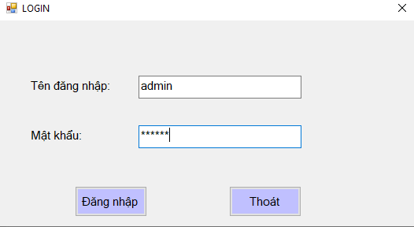
### Sau khi đăng nhập thành công với tên đăng nhập là "admin", mật khẩu là "123456", giao diện đăng nhập sẽ chuyển sang giao diện chính của phần mềm

## Giao diện chính
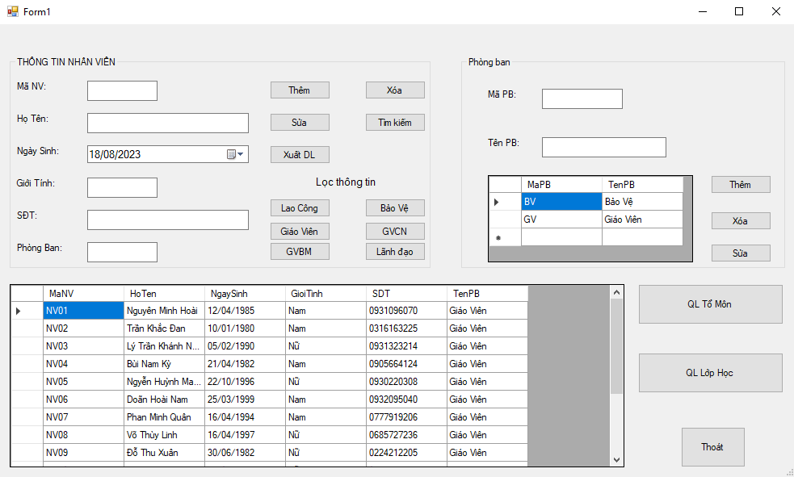
### Ở bên bên trái giao diện chính là khung "Thông tin nhân viên", chứa các textbox để nhập và nhận thông tin. Cùng với các button với các chức năng cơ bản tương ứng như Thêm, Xóa, Sửa, Tìm kiếm và xuất DL.
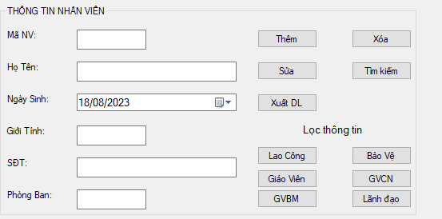
### Với datagrid view bên dưới có vai trò là View đối với khung "Thông tin nhân viên"
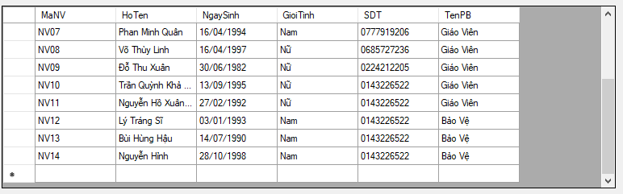
### Thực hiện thao tác thêm mới nhân viên, ta điền đầy đủ thông tin cần nhập vào các textbox và ấn button "Thêm" để thực hiện thêm nhân viên mới:
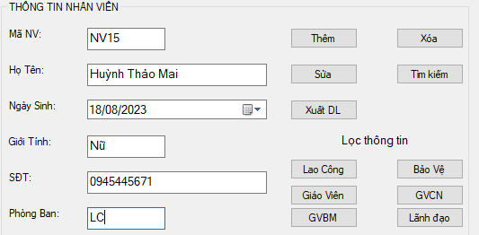
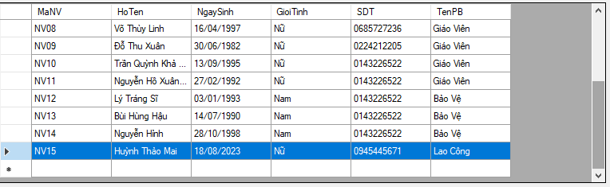
### Muốn chỉnh sửa thông tin, ta chỉ cần click vào đầu dòng nhân viên mà ta muốn sữa, toàn bộ thông tin của nhân viên đó sẽ được đưa lên các textbox tương ứng để thuận tiện trong việc chỉnh sửa thông tin:
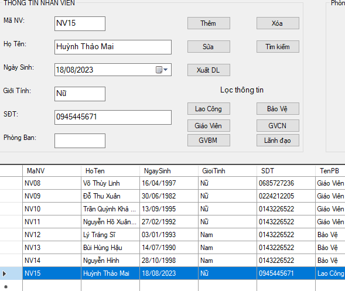
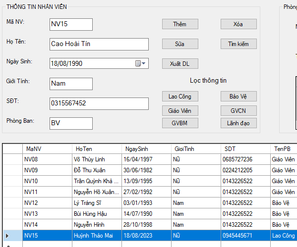
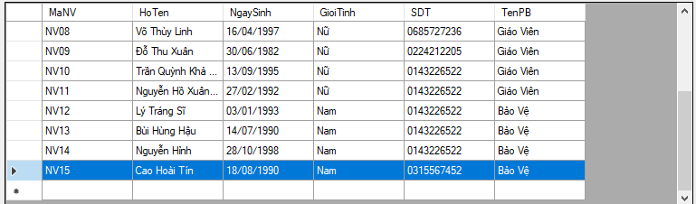
### Để xóa nhân viên, ta chỉ cần click vào đầu dòng của nhân viên mag ta cần muốn và thực hiện button "Xóa"
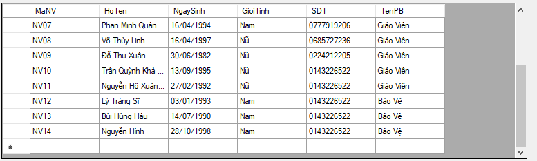
### Đối với chức năng "Tìm kiếm" thì ta sẽ thực hiện tìm kiếm theo ký tự mà ta đã nhập ở textbox "Họ tên"
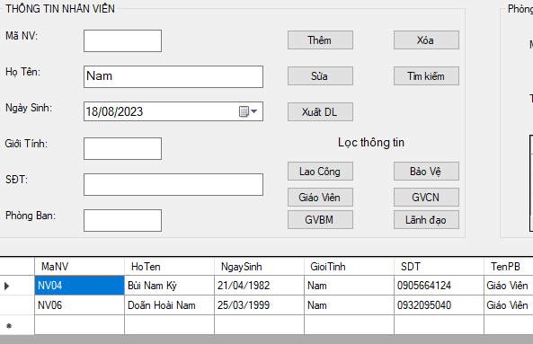
### Chức năng "Xuất DL" sẽ xuất thông tin ra file excel. Chức năng này sẽ đưa toàn bộ những gì hiển thị trên datagrid view của "Thông tin nhân viện" ra ngoài file excel một cách tự động.
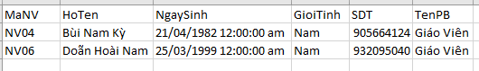
### Ngoài ra còn có các chức năng như lọc thông tin, nhằm giúp ta xem được các danh mục nhân viên của các nhóm chức vụ cụ thể một cách nhanh chóng, ở đây ví dụ như là nhóm "GVCN"
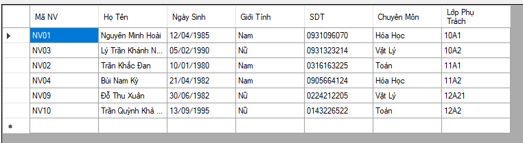
### Ngoài ra bên góc phải giao diện chính còn khung "Phòng ban" để xem và tạo mới các phòng ban có ở trường học.
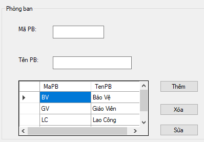
### Button thoát sẽ đóng phần mềm hoàn toàn
### Với 2 button là "QL Tổ Môn" và "QL Lớp Học" sẽ đưa giao diện chính chuyển sang giao diện tương ứng theo tên button, gồm các chức năng tương tự như ở giao diện khung "Thông tin nhân viên"
### QL Tổ Môn
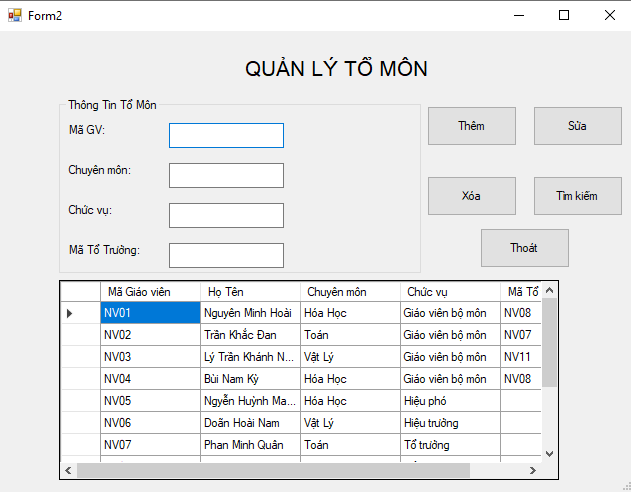
### QL Lớp Học
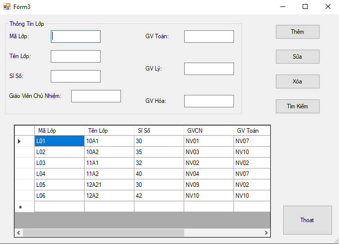
### Button thoát ở 2 giao diện phụ này sẽ đóng giao diện hiện tại và đưa sang giao diện chính.
# End.